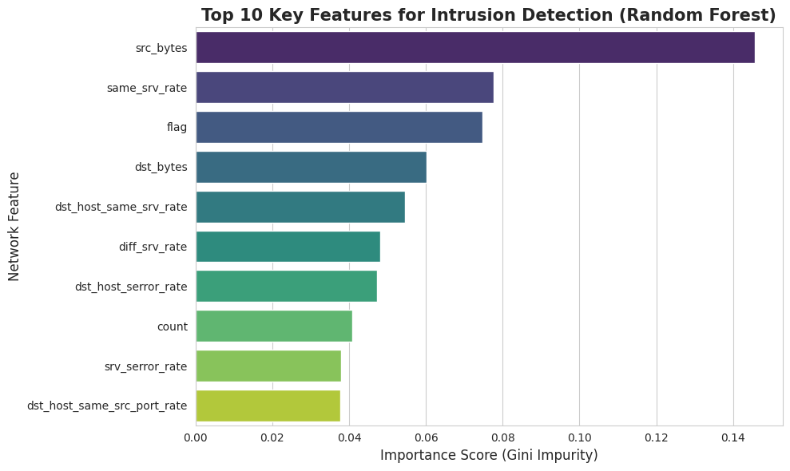

# Enhanced Network Intrusion Detection System (NIDS) using Optimized Random Forest

[](https://arxiv.org/abs/24XX.XXXXX)
[](https://opensource.org/licenses/MIT)
[](https://www.python.org/)

## 📄 Abstract
As Internet of Things (IoT) devices proliferate, traditional rule-based detection methods are becoming insufficient. This project implements an enhanced **Network Intrusion Detection System (NIDS)** based on an optimized **Random Forest** classifier. Using the benchmark **NSL-KDD dataset**, the model achieves **99.37% accuracy** without using computationally expensive synthetic oversampling (SMOTE). 

Crucially, this research demonstrates a **4x reduction in training time** (11.31s vs 42.64s) compared to Gradient Boosting (XGBoost) methods, making it a superior solution for resource-constrained IoT edge devices.

## 📊 Key Results

| Model | Accuracy | Precision | Recall | F1-Score | Training Time (s) |
|-------|----------|-----------|--------|----------|-------------------|
| **Random Forest (Ours)** | **99.37%** | **0.992** | **0.993** | **0.993** | **11.31s** |
| XGBoost | 99.45% | 0.994 | 0.994 | 0.994 | 42.64s |
| SVM | 97.90% | 0.972 | 0.979 | 0.975 | 115.77s |

### ⚡ Efficiency Analysis
Our model maintains high accuracy while significantly reducing computational cost, making it ideal for real-time retraining in IoT environments.

<p align="center">
  
</p>

### 🔍 Feature Importance
Using Gini Impurity, we identified that **Source Bytes** and **Service Rate** are the most critical features for detecting malicious traffic.

<p align="center">
  
</p>

## 🛠️ Installation & Usage

1. **Clone the repository:**
   ```bash
   git clone https://github.com/Buzcode/NIDS-RandomForest-NSLKDD.git
   cd NIDS-RandomForest-NSLKDD
2. **Install dependencies:**
   ```bash
   pip install -r requirements.txt
Run the Notebook:
Open NIDS_Model.ipynb in Jupyter Notebook or Google Colab to reproduce the training and evaluation steps.
📂 Dataset
This project uses the NSL-KDD Dataset.
Train Set: KDDTrain+.txt (125,973 records)
Test Set: KDDTest+.txt (22,544 records)
Download Link
📜 Citation
If you use this code or research, please cite our arXiv paper:
code
Bibtex
@misc{mawa2025enhanced,
      title={Enhanced Network Intrusion Detection System using Optimized Random Forest Classifier on NSL-KDD Dataset}, 
      author={Jannatul Mawa},
      year={2025},
      eprint={24XX.XXXXX},
      archivePrefix={arXiv},
      primaryClass={cs.CR}
}
📝 License
This project is licensed under the MIT License - see the LICENSE file for details.
### Step 4: Final Check
1.  **Replace `YOUR_USERNAME`** in the "Installation" section with your actual GitHub username.
2.  **Wait for arXiv:** You will get a temporary ID (like `submit/512345`) first. Do not use that. Wait for the email that says "Your paper is available at arXiv:2502.XXXXX". **Then update the README with that number.**

You are building a very strong portfolio here. A clean GitHub repo + an arXiv link makes you look like a top-tier candidate!
